# Painel de Controle de Licenças

Plataforma web para controle de licenças de software, acompanhada de componente e aplicação de demonstração em Delphi.

## Recursos

- Liberação e bloqueio de licenças online e offline
- Cadastro de clientes, revendas, sistemas e usuários
- Controle financeiro e valores individuais de licença
- Controle da quantidade de estações liberadas por cliente
- Associação de clientes às revendas
- Permissões separadas para administradores e revendas
- Consulta e manutenção das liberações em uma única plataforma web

## Tecnologias

- PHP
- MySQL / MariaDB
- HTML, CSS e JavaScript
- Delphi VCL
- Firebird na aplicação de demonstração

## Conteúdo

- Plataforma web em PHP
- Esquema SQL sem dados pessoais
- Componente de licenciamento para Delphi
- Código-fonte da aplicação de demonstração

## Instalação da plataforma web

1. Importe `banco/liberacao.sql` em uma base MySQL ou MariaDB vazia.
2. Copie `src/CLASSES/conexao.example.php` para `src/CLASSES/conexao.php`.
3. Edite o novo arquivo com o servidor, usuário, senha e nome da sua base.
4. Publique o conteúdo de `src` em um servidor com PHP e extensão MySQLi.

O arquivo de conexão real é ignorado pelo Git para evitar o envio acidental de credenciais.

## Demonstração Delphi

O banco Firebird original não faz parte do repositório porque continha dados locais. Configure uma base própria e ajuste a conexão no projeto `demo/DemoPlataforma.dproj` antes de executar.

## Imagens

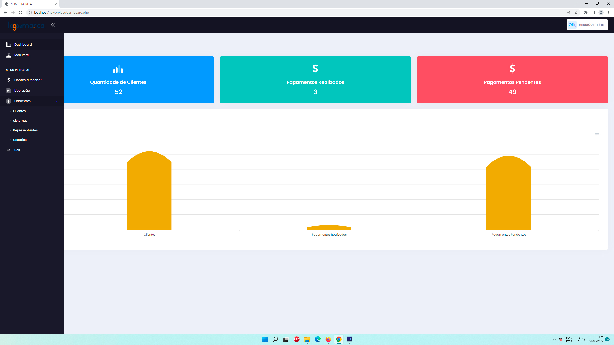

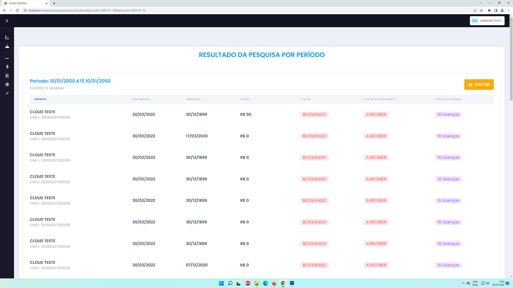

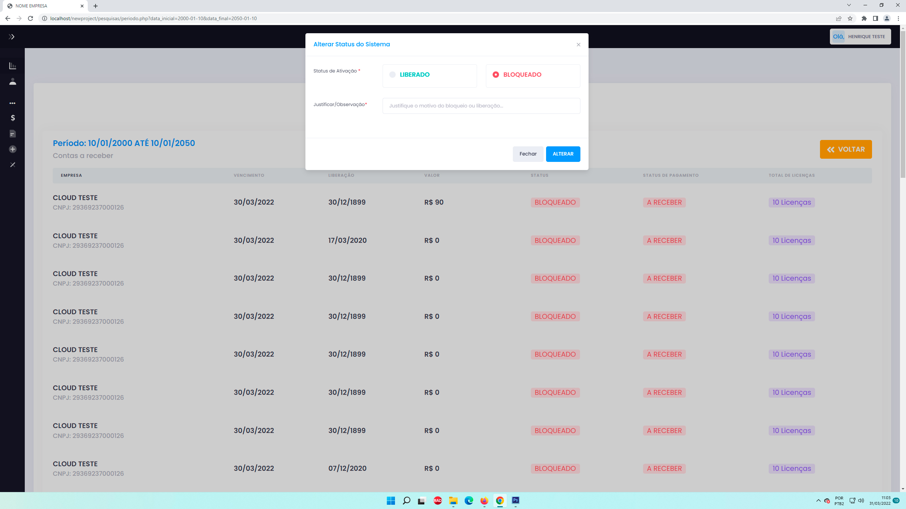

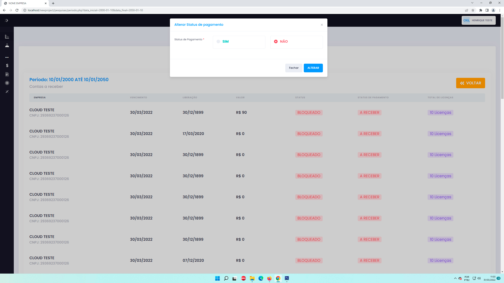

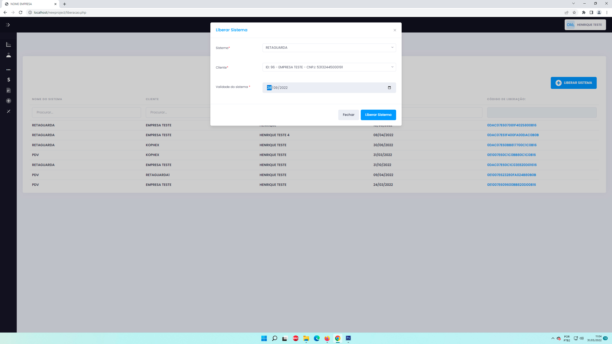

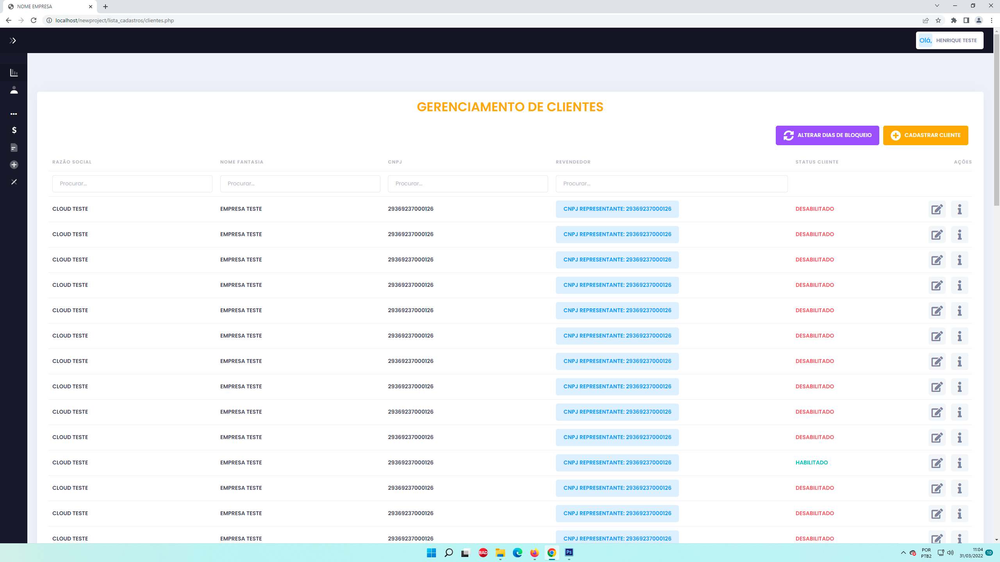

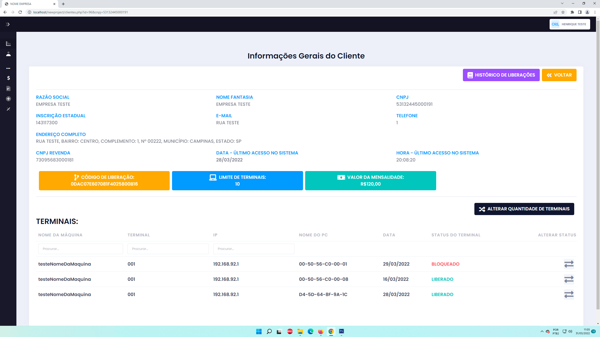

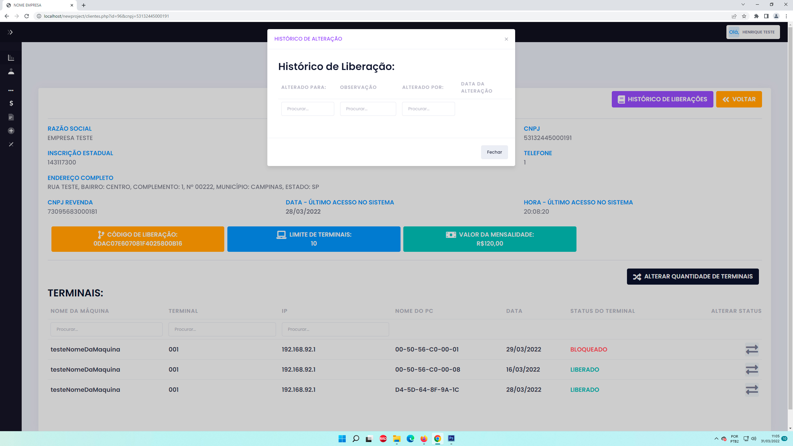

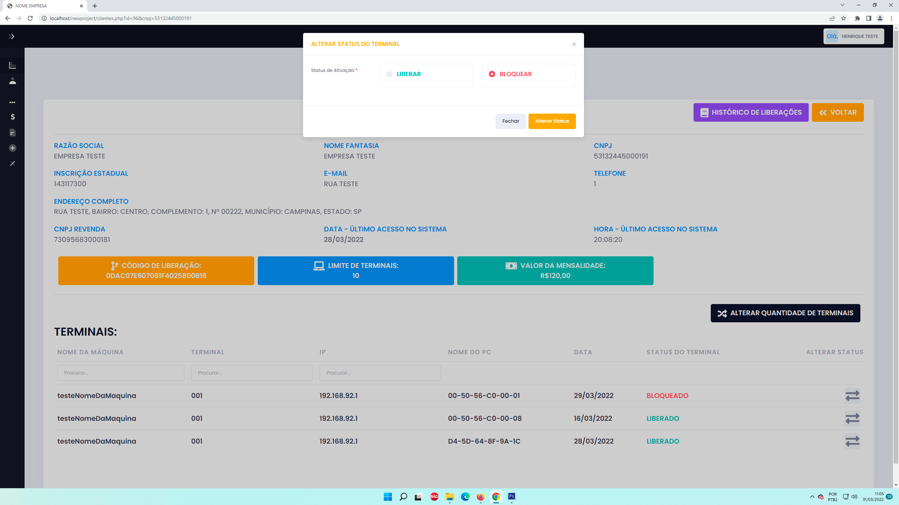

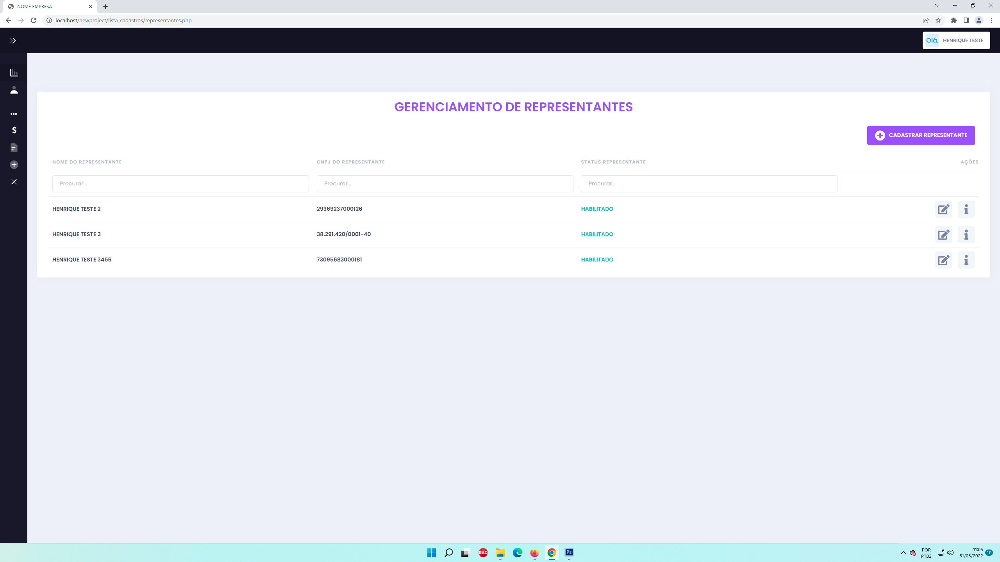

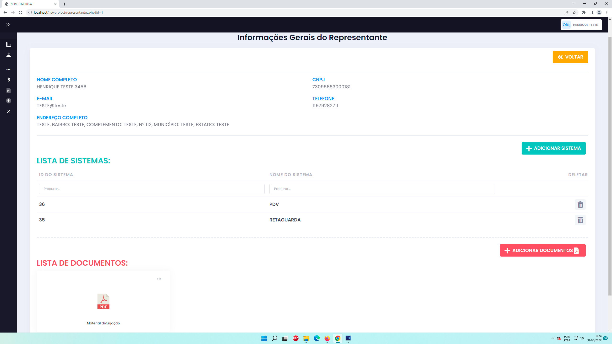

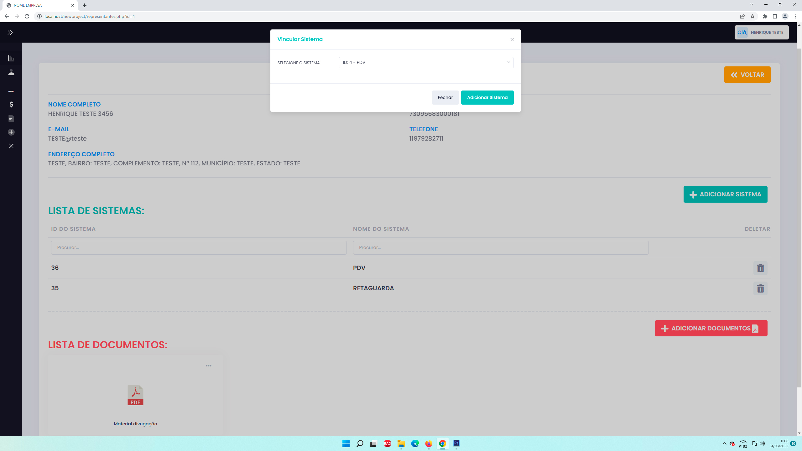

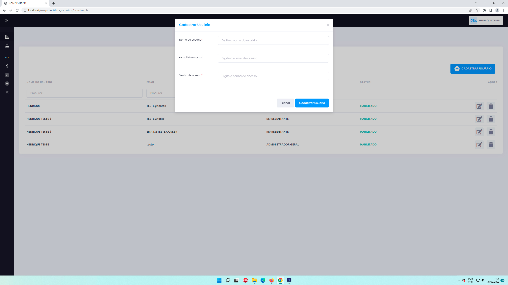

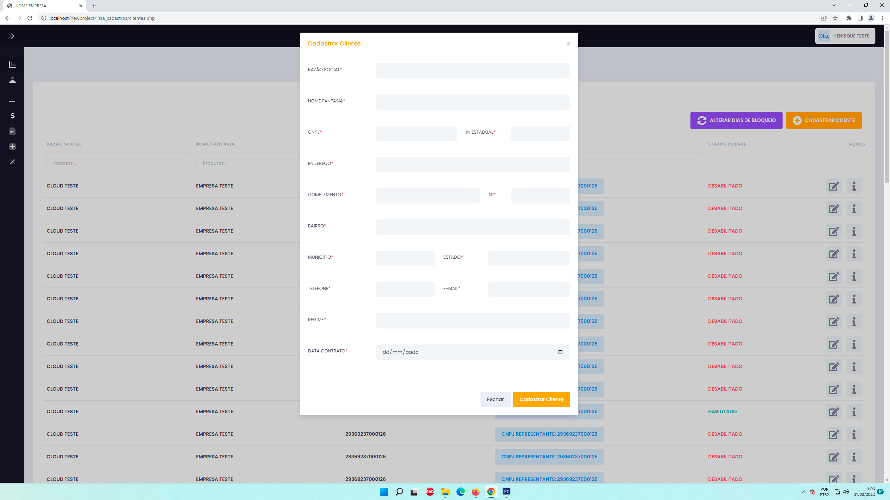

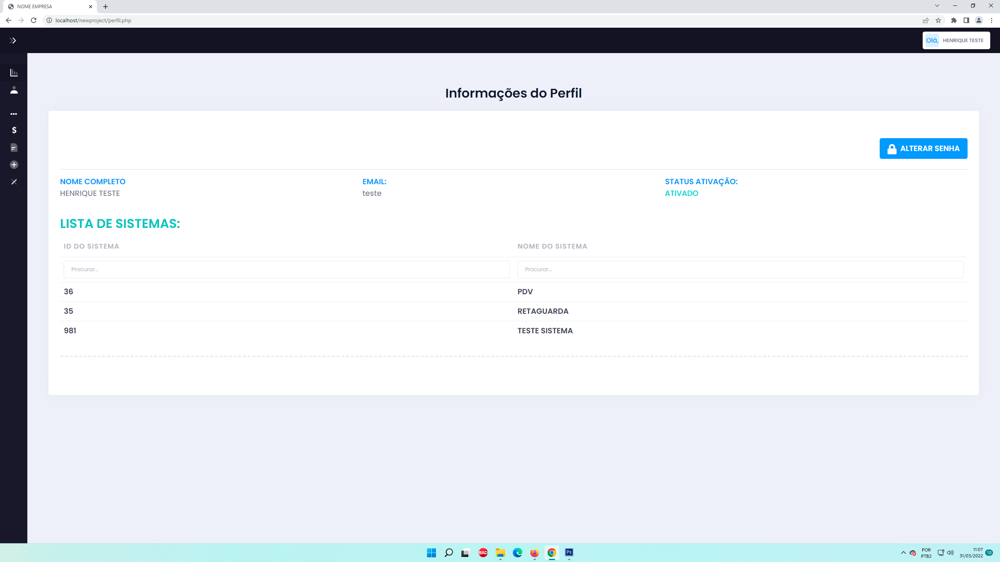

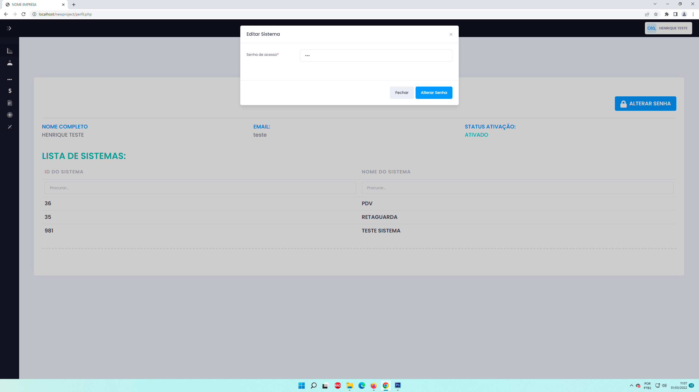

## Segurança

O dump SQL foi disponibilizado somente com a estrutura das tabelas. Usuários, senhas, hashes, sessões, endereços IP e demais registros do ambiente original foram removidos.

## Observação

Projeto independente para estudo, personalização e evolução pela comunidade. Delphi, Firebird, PHP e MySQL são marcas de seus respectivos proprietários.
